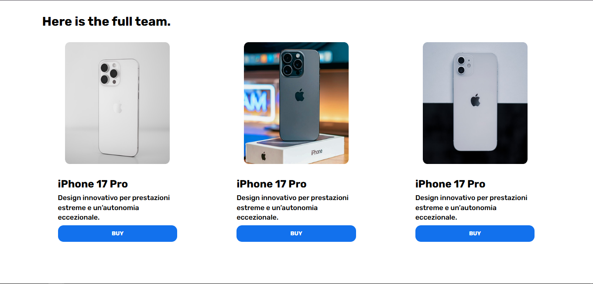
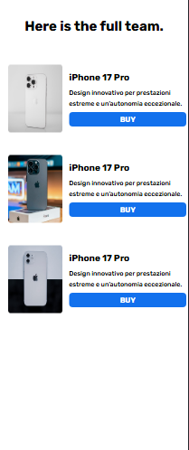
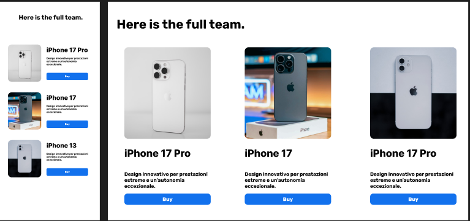

# iPhone Product Menu Page

An implementation of an Apple-style product menu page built with
HTML
and
Tailwind CSS
. The initial design was created in
Figma
and then carefully translated into code.

## Project Preview

## Figma Design

## About the Project

This project is a menu page featuring three products from the iPhone lineup, inspired by Apple's minimal and elegant design language. The main focus was on accurately implementing the Figma design, maintaining proper spacing, appropriate typography, and responsive layout.

## Tech Stack
HTML5
Tailwind CSS

## Features

- Fully responsive design for mobile, tablet, and desktop
- Minimal, modern styling inspired by Apple's design system
- Pixel-accurate implementation based on the Figma design
- Three detailed product cards
 
## Getting Started
git clone https://github.com/AREF-Esnaashari/iPhone-product-menu.git
cd iPhone-product-menu
